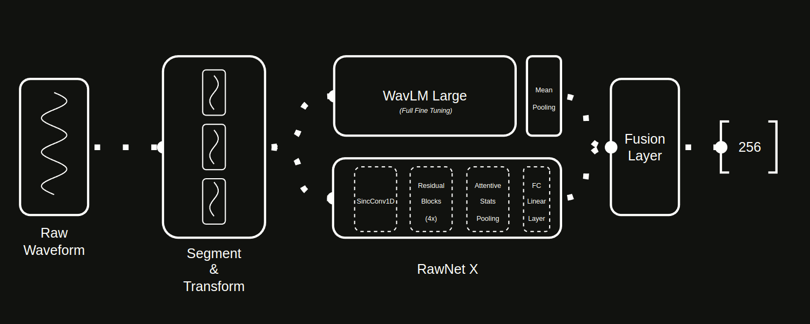

<div align="center">

# WavLMRawNetXSVBase

### `WavLM Large + RawNetX Speaker Verification Base: End-to-End Speaker Verification Architecture`

This architecture combines **WavLM Large** and **RawNetX** to learn both **micro** and **macro** features directly
from raw waveforms. The goal is to obtain a **fully end-to-end** model, avoiding any manual feature extraction (e.g.,
MFCC, mel-spectrogram). Instead, the network itself discovers the most relevant frequency and temporal patterns for
speaker verification.

**Note**: _If you would like to contribute to this repository,
please read the [CONTRIBUTING](.docs/documentation/CONTRIBUTING.md) first._


[](https://linkedin.com/in/bunyaminergen)

</div>

---

### Table of Contents

- [Introduction](#introduction)
- [Architecture](#architecture)
- [Reports](#reports)
- [Prerequisites](#prerequisites)
- [Installation](#installation)
- [File Structure](#file-structure)
- [Version Control System](#version-control-system)
- [Upcoming](#upcoming)
- [Documentations](#documentations)
- [License](#licence)
- [Links](#links)
- [Team](#team)
- [Contact](#contact)
- [Citation](#citation)

---

### Introduction

##### Combine WavLM Large and RawNetX

- WavLM Large
    - Developed by Microsoft, WavLM relies on self-attention layers that capture fine-grained (`frame-level`) or “micro”
      acoustic features.
    - It produces a **1024-dimensional** embedding, focusing on localized, short-term variations in the speech signal.

- RawNetX
    - Uses SincConv and residual blocks to summarize the raw signal on a broader (macro) scale.
    - The **Attentive Stats Pooling** layer aggregates mean + std across the entire time axis (with learnable
      attention),
      capturing global speaker characteristics.
    - Outputs a **256-dimensional** embedding, representing the overall, longer-term structure of the speech.

These two approaches complement each other: WavLM Large excels at fine-detailed temporal features, while RawNetX
captures a more global, statistical overview.

##### Architectural Flow

- Raw Audio Input
    - **No manual preprocessing** (like MFCC or mel-spectrogram).
    - A minimal **Transform** and **Segment** step (mono conversion, resample, slice/pad) formats the data into shape
      `(B, T)`.

- RawNetX (Macro Features)
    - SincConv: Learns band-pass filters in a frequency-focused manner, constrained by low/high cutoff frequencies.
    - ResidualStack: A set of residual blocks (optionally with SEBlock) refines the representation.
    - Attentive Stats Pooling: Aggregates time-domain information into mean and std with a learnable attention
      mechanism.
    - A final **FC** layer yields a 256-dimensional embedding.

- WavLM Large (Micro Features)
    - Transformer layers operate at `frame-level`, capturing fine-grained details.
    - Produces a **1024-dimensional** embedding after mean pooling across time.

- Fusion Layer
    - Concatenate the **256-dim** RawNetX embedding with the **1024-dim** WavLM embedding, resulting in **1280**
      dimensions.
    - A **Linear(1280 → 256) + ReLU** layer reduces it to a **256-dim Fusion Embedding**, combining micro and macro
      insights.

- AMSoftmax Loss
    - During training, the 256-dim fusion embedding is passed to an AMSoftmax classifier (with margin + scale).
    - Embeddings of the same speaker are pulled closer, while different speakers are pushed apart in the angular space.

##### A Single End-to-End Learning Pipeline

- Fully Automatic: Raw waveforms go in, final speaker embeddings come out.
- No Manual Feature Extraction: We do not rely on handcrafted features like MFCC or mel-spectrogram.
- Data-Driven: The model itself figures out which frequency bands or time segments matter most.
- Enhanced Representation: WavLM delivers local detail, RawNetX captures global stats, leading to a more robust
  speaker representation.

##### Why Avoid Preprocessing?

- Deep Learning Principle: The model should learn how to process raw signals rather than relying on human-defined
  feature pipelines.
- Better Generalization: Fewer hand-tuned hyperparameters; the model adapts better to various speakers, languages, and
  environments.
- Scientific Rigor: Manual feature engineering can introduce subjective design choices. Letting the network learn
  directly from data is more consistent with data-driven approaches.

##### Performance & Advantages

- Micro + Macro Features Combined
    - Captures both short-term acoustic nuances (WavLM) and holistic temporal stats (RawNetX).

- Truly End-to-End
    - Beyond minimal slicing/padding, all layers are trainable.
    - No handcrafted feature extraction is involved.

- VoxCeleb1 Test Results
    - Achieved an **EER of 4.67%** on the VoxCeleb1 evaluation set.

- Overall Benefits
    - Potentially outperforms using WavLM or RawNetX alone on standard metrics like EER and minDCF.
    - Combining both scales of analysis yields a richer speaker representation.

In essence, **WavLM Large + RawNetX** merges two scales of speaker representation to produce a **unified 256-dim
embedding**. By staying fully end-to-end, the architecture remains flexible and can leverage large amounts of data for
improved speaker verification results.

---

### Architecture



---

### Reports

##### Benchmark

*Speaker Verification Benchmark on VoxCeleb1 Dataset*

| Model                         | EER   |
|-------------------------------|-------|
| **ReDimNet-B6-SF2-LM-ASNorm** | 0.37  |
| **WavLM+ECAPA-TDNN**          | 0.39  |
| ...                           | ...   |
| **TitanNet-L**                | 0.68	 |
| ...                           | ...   |
| **SpeechNAS**                 | 1.02	 |
| ...                           | ...   |
| **Multi Task SSL**            | 1.98	 |
| ...                           | ...   |
| **WavLMRawNetXSVBase**        | 4.67	 |

---

### Prerequisites

##### Inference

- `Python3.11` _(or above)_

##### For trainig from scratch

- `10GB Disk Space` _(for VoxCeleb1 Dataset)_
- `12GB VRAM GPU` _(or above)_

---

### Installation

##### Linux/Ubuntu

```bash
sudo apt update -y && sudo apt upgrade -y
```

```bash
sudo apt install -y ffmpeg
```

```bash
git clone https://github.com/bunyaminergen/WavLMRawNetXSVBase
```

```bash
cd WavLMRawNetXSVBase
```

```bash
conda env create -f environment.yaml
```

```bash
conda activate WavLMRawNetXSVBase
```

##### Dataset Download (if training from scratch)

1. Please go to the url and register: [KAIST MM](https://cn01.mmai.io/keyreq/voxceleb)
2. After receiving the e-mail, you can download the dataset directly from the e-mail by clicking on the link or you can
   use the following commands.

   **Note**: *To download from the command line, you must take the key parameter from the
   link
   in the e-mail and place it in the relevant place in the command line below.*
3. To download `List of trial pairs - VoxCeleb1 (cleaned)` please go to the
   url: [VoxCeleb](https://mm.kaist.ac.kr/datasets/voxceleb/)

**VoxCeleb1**

Dev A

```bash
wget -c --no-check-certificate -O vox1_dev_wav_partaa "https://cn01.mmai.io/download/voxceleb?key=<YOUR_KEY>&file=vox1_dev_wav_partaa"
```

Dev B

```bash
wget -c --no-check-certificate -O vox1_dev_wav_partab "https://cn01.mmai.io/download/voxceleb?key=<YOUR_KEY>&file=vox1_dev_wav_partab"
```

Dev C

```bash
wget -c --no-check-certificate -O vox1_dev_wav_partac "https://cn01.mmai.io/download/voxceleb?key=<YOUR_KEY>&file=vox1_dev_wav_partac"
```

Dev D

```bash
wget -c --no-check-certificate -O vox1_dev_wav_partad "https://cn01.mmai.io/download/voxceleb?key=<YOUR_KEY>&file=vox1_dev_wav_partad"

```

Concatenate

```bash
cat vox1_dev* > vox1_dev_wav.zip
```

Test

```bash
wget -c --no-check-certificate -O vox1_test_wav.zip "https://cn01.mmai.io/download/voxceleb?key=<YOUR_KEY>&file=vox1_test_wav.zip"
```

List of trial pairs - VoxCeleb1 (cleaned)

```bash
wget https://mm.kaist.ac.kr/datasets/voxceleb/meta/veri_test2.txt
```

---

### File Structure

```Text
.
├── .data
│   ├── dataset
│   │   ├── raw
│   │   │   └── VoxCeleb1
│   │   │       ├── dev
│   │   │       │   └── vox1_dev_wav.zip
│   │   │       └── test
│   │   │           └── vox1_test_wav.zip
│   │   └── train
│   │       └── VoxCeleb1
│   │           ├── dev
│   │           │   └── vox1_dev_wav
│   │           │       └── wav
│   │           │           ├── id10001
│   │           │           │   ├── 1zcIwhmdeo4
│   │           │           │   │   ├── 00001.wav
│   │           │           │   │   ├── 00002.wav
│   │           │           │   │   ├── 00003.wav
│   │           │           │   │   └── ...
│   │           │           │   ├── 7gWzIy6yIIk
│   │           │           │   │   ├── 00001.wav
│   │           │           │   │   ├── 00002.wav
│   │           │           │   │   ├── 00003.wav
│   │           │           │   │   └── ...
│   │           │           │   └── ...
│   │           │           │       └── ...
│   │           │           ├── id10002
│   │           │           │   ├── 6WO410QOeuo
│   │           │           │   │   ├── 00001.wav
│   │           │           │   │   ├── 00002.wav
│   │           │           │   │   ├── 00003.wav
│   │           │           │   │   └── ...
│   │           │           │   ├── C7k7C-PDvAA
│   │           │           │   │   ├── 00001.wav
│   │           │           │   │   ├── 00002.wav
│   │           │           │   │   ├── 00003.wav
│   │           │           │   │   └── ...
│   │           │           │   └── ...
│   │           │           │       └── ...
│   │           │           ├── id10003
│   │           │           │   ├── 5ablueV_1tw
│   │           │           │   │   ├── 00001.wav
│   │           │           │   │   ├── 00002.wav
│   │           │           │   │   ├── 00003.wav
│   │           │           │   │   └── ...
│   │           │           │   ├── A7Hh1WKmHsg
│   │           │           │   │   ├── 00001.wav
│   │           │           │   │   ├── 00002.wav
│   │           │           │   │   ├── 00003.wav
│   │           │           │   │   └── ...
│   │           │           │   └── ...
│   │           │           │       └── ...
│   │           │           ├── ...
│   │           │           │   └── ...
│   │           │           │       └── ...
│   │           │           ├── id11250
│   │           │           │   ├── 09AvzdGWvhA
│   │           │           │   │   ├── 00001.wav
│   │           │           │   │   ├── 00002.wav
│   │           │           │   │   ├── 00003.wav
│   │           │           │   │   └── ...
│   │           │           │   ├── 1BmQvhvvrhY
│   │           │           │   │   ├── 00001.wav
│   │           │           │   │   ├── 00002.wav
│   │           │           │   │   ├── 00003.wav
│   │           │           │   │   └── ...
│   │           │           │   └── ...
│   │           │           │       └── ...
│   │           │           └── id11251
│   │           │               ├── 5-6lI5JQtb8
│   │           │               │   ├── 00001.wav
│   │           │               │   ├── 00002.wav
│   │           │               │   ├── 00003.wav
│   │           │               │   └── ...
│   │           │               └── XHCSVYEZvlM
│   │           │                   ├── 00001.wav
│   │           │                   ├── 00002.wav
│   │           │                   ├── 00003.wav
│   │           │                   └── ...
│   │           └── test
│   │               ├── veri_test2.txt
│   │               └── vox1_test_wav
│   │                   └── wav
│   │                       ├── id10270
│   │                       │   ├── 5r0dWxy17C8
│   │                       │   │   ├── 00001.wav
│   │                       │   │   ├── 00002.wav
│   │                       │   │   ├── 00003.wav
│   │                       │   │   └── ...
│   │                       │   ├── 5sJomL_D0_g
│   │                       │   │   ├── 00001.wav
│   │                       │   │   ├── 00002.wav
│   │                       │   │   ├── 00003.wav
│   │                       │   │   └── ...
│   │                       │   └── ...
│   │                       │       └── ...
│   │                       ├── id10271
│   │                       │   ├── 1gtz-CUIygI
│   │                       │   │   ├── 00001.wav
│   │                       │   │   ├── 00002.wav
│   │                       │   │   ├── 00003.wav
│   │                       │   │   └── ...
│   │                       │   ├── 37nktPRUJ58
│   │                       │   │   ├── 00001.wav
│   │                       │   │   ├── 00002.wav
│   │                       │   │   ├── 00003.wav
│   │                       │   │   └── ...
│   │                       │   └── ...
│   │                       │       └── ...
│   │                       ├── ...
│   │                       │   └── ...
│   │                       │       └── ...
│   │                       └── id10309
│   │                           ├── 0b1inHMAr6o
│   │                           │   ├── 00001.wav
│   │                           │   ├── 00002.wav
│   │                           │   ├── 00003.wav
│   │                           │   └── ...
│   │                           └── Zx-zA-D_DvI
│   │                               ├── 00001.wav
│   │                               ├── 00002.wav
│   │                               ├── 00003.wav
│   │                               └── ...
│   └── example
│       ├── enroll
│       │   ├── speaker1_enroll_en.wav
│       │   └── speaker1_enroll_tr.wav
│       └── test
│           ├── speaker1_test_en.wav
│           ├── speaker1_test_tr.wav
│           ├── speaker2_test_en.wav
│           └── speaker2_test_tr.wav
├── .docs
│   ├── documentation
│   │   ├── CONTRIBUTING.md
│   │   └── RESOURCES.md
│   └── img
│       └── architecture
│           ├── WavLMRawNetXSVBase.drawio
│           └── WavLMRawNetXSVBase.gif
├── environment.yaml
├── .github
│   └── CODEOWNERS
├── .gitignore
├── LICENSE
├── main.py
├── notebook
│   └── test.ipynb
├── README.md
├── requirements.txt
└── src
    ├── config
    │   ├── config.yaml
    │   └── schema.py
    ├── evaluate
    │   └── metric.py
    ├── model
    │   ├── backbone.py
    │   ├── block.py
    │   ├── convolution.py
    │   ├── fusion.py
    │   ├── loss.py
    │   └── pooling.py
    ├── preprocess
    │   ├── feature.py
    │   └── transformation.py
    ├── process
    │   ├── test.py
    │   └── train.py
    └── utils
        └── data
            └── manager.py

23779 directories, 153552 files
```

---

### Version Control System

##### Releases

- [v1.0.0](https://github.com/bunyaminergen/WavLMRawNetXSVBase/archive/refs/tags/v1.0.0.zip) _.zip_
- [v1.0.0](https://github.com/bunyaminergen/WavLMRawNetXSVBase/archive/refs/tags/v1.0.0.tar.gz) _.tar.gz_

##### Branches

- [main](https://github.com/bunyaminergen/WavLMRawNetXSVBase/main/)
- [develop](https://github.com/bunyaminergen/WavLMRawNetXSVBase/develop/)

---

### Upcoming

- [ ] **BasePlus Model:** Build a new archtitecture and train for better EER.
- [ ] **HuggingFace Model Hub:** Add model to HuggingFace Model Hub.
- [ ] **HuggingFace Space:** Add demo to HuggingFace Space.
- [ ] **Pytorch Hub:** Add model to Pytorch Hub.

---

### Documentations

- [RESOURCES](.docs/documentation/RESOURCES.md)
- [CONTRIBUTING](.docs/documentation/CONTRIBUTING.md)

---

### Licence

- [LICENSE](LICENSE)

---

### Links

- [Github](https://github.com/bunyaminergen/WavLMRawNetXSVBase)
- [Website](https://bunyaminergen.com)
- [Linkedin](https://www.linkedin.com/in/bunyaminergen)

---

### Team

- [Bunyamin Ergen](https://www.linkedin.com/in/bunyaminergen)

---

### Contact

- [Mail](mailto:info@bunyaminergen.com)

---

### Citation

```bibtex
@software{       WavLMRawNetXSVBase,
  author       = {Bunyamin Ergen},
  title        = {{WavLMRawNetXSVBase}},
  year         = {2025},
  month        = {02},
  url          = {https://github.com/bunyaminergen/WavLMRawNetXSVBase},
  version      = {v1.0.0},
}
```

---
